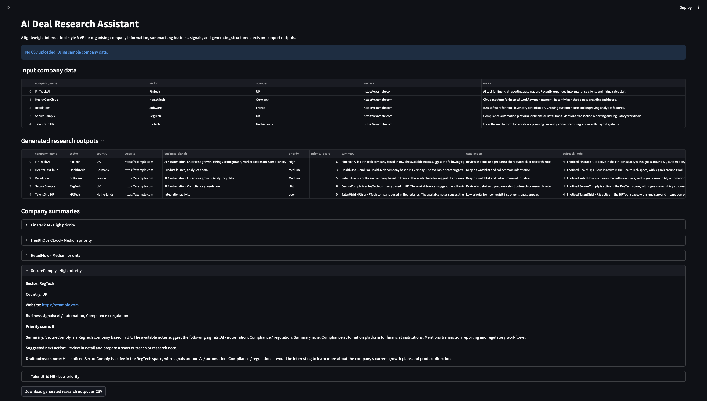

# AI Deal Research Assistant

AI Deal Research Assistant is a lightweight Python and Streamlit MVP for organising company information, identifying business signals, and generating structured decision-support outputs for company research workflows.

The project is designed as an internal-tool style prototype for business research, workflow automation, and investment/origination-style use cases.

## Demo screenshot



## Overview

Investment and business development teams often work with messy company information spread across spreadsheets, websites, notes, news, and CRM systems. This can make it difficult to quickly understand which companies are worth prioritising, what signals matter, and what the next action should be.

This project explores how a simple AI-assisted research tool can turn unstructured company notes into clear, structured, and useful outputs.

## Current MVP

The current version includes a working Streamlit interface where users can load sample company data or upload a CSV file with company information.

The app processes the input and generates:

* short company summaries
* detected business signals
* priority levels
* priority scores
* suggested next actions
* draft outreach-style notes
* downloadable research output as CSV

## Key features

* CSV upload for company research data
* Clean table view of input companies
* Business signal detection from company notes
* Simple priority scoring logic
* Structured company summaries
* Next-action suggestions
* Draft outreach notes
* CSV export of generated research outputs
* Streamlit interface for quick interaction

## Example use cases

* Company research for investment or business development teams
* Internal workflow automation
* Market mapping and target prioritisation
* Summarising business signals from company notes
* Creating structured outputs from messy research data
* Supporting origination-style workflows

## Tech stack

* Python
* pandas
* Streamlit
* CSV data handling
* Rule-based signal detection
* Basic data cleaning and structuring

## Project structure

```text
ai-deal-research-assistant/
├── app.py
├── sample_companies.csv
├── requirements.txt
├── .gitignore
└── README.md
```

## Sample input

```csv
company_name,sector,country,website,notes
FinTrack AI,FinTech,UK,https://example.com,"AI tool for financial reporting automation. Recently expanded into enterprise clients and hiring sales staff."
HealthOps Cloud,HealthTech,Germany,https://example.com,"Cloud platform for hospital workflow management. Recently launched a new analytics dashboard."
RetailFlow,Software,France,https://example.com,"B2B software for retail inventory optimisation. Growing customer base and improving analytics features."
SecureComply,RegTech,UK,https://example.com,"Compliance automation platform for financial institutions. Mentions transaction reporting and regulatory workflows."
TalentGrid HR,HRTech,Netherlands,https://example.com,"HR software platform for workforce planning. Recently announced integrations with payroll systems."
```

## Example output

For each company, the app generates:

* company summary
* business signals
* priority level
* priority score
* suggested next action
* draft outreach note

Example output fields:

```text
company_name
sector
country
website
business_signals
priority
priority_score
summary
next_action
outreach_note
```

## How to run locally

Clone the repository:

```bash
git clone https://github.com/Roman-Prodeus07/ai-deal-research-assistant.git
cd ai-deal-research-assistant
```

Create and activate a virtual environment:

```bash
python3 -m venv .venv
source .venv/bin/activate
```

Install dependencies:

```bash
pip install -r requirements.txt
```

Run the Streamlit app:

```bash
streamlit run app.py
```

## Why I am building this

I am building this project to practise creating practical AI and automation tools that are useful in real workflows, not just demos.

The focus is on product thinking as much as technical implementation: understanding the user problem, designing a simple workflow, generating useful outputs, and improving the tool through feedback.

## Future improvements

* Add LLM integration through OpenAI or Claude
* Add web scraping for public company information
* Add news and trigger monitoring
* Add CRM-style company tagging
* Add export to Excel
* Improve priority scoring logic
* Add dashboard views for company segments and priorities
* Add authentication and saved research sessions

## Related skills

This project helps develop skills in:

* Python
* Streamlit
* pandas
* AI workflow design
* data cleaning
* product thinking
* business automation
* internal tool development
* decision-support systems

## Author

Roman Prodeus
Computer Science (Artificial Intelligence) student at the University of Greenwich
London, UK

LinkedIn: https://linkedin.com/in/roman-prodeus-3726172b2
GitHub: https://github.com/Roman-Prodeus07

